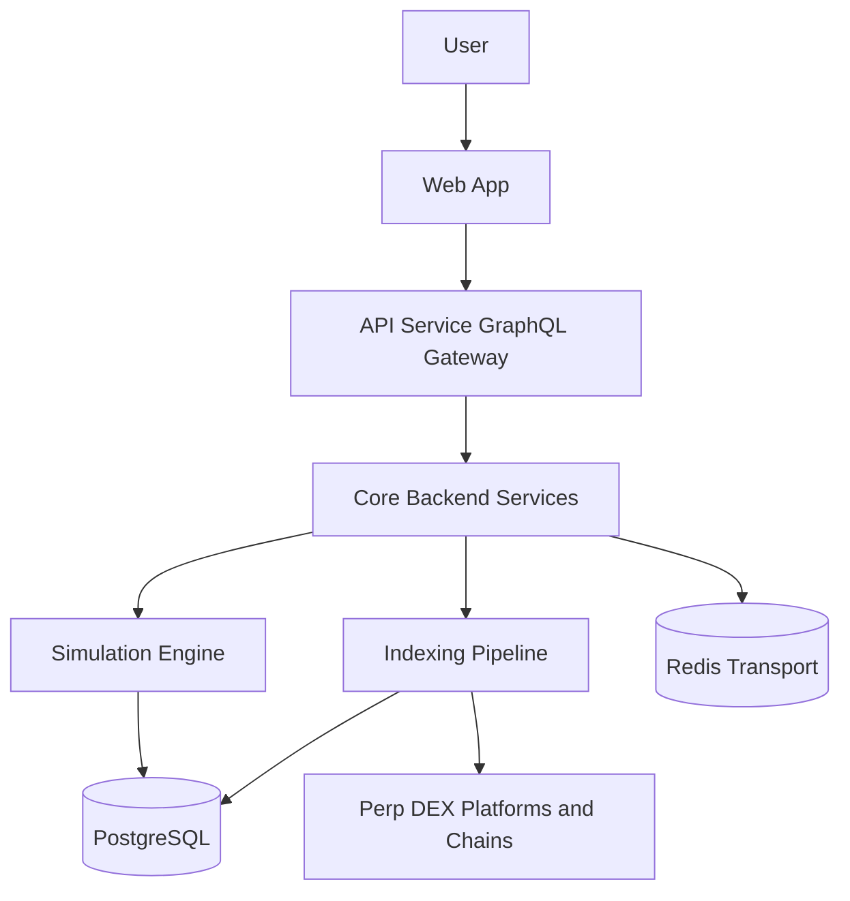

# System Overview

LuckyPlans currently spans three practical layers:

- the public docs and landing surfaces in the `beta` monorepo
- the current product frontend in `lucky-plan-fe`
- the current product backend in `lucky-plan-be`

The real trading, analytics, and simulation behavior documented here comes from the split frontend and backend repositories mirrored locally under `../alpha/fe` and `../alpha/be`.

## High-level architecture

## Layers

| Layer | Current implementation |
| --- | --- |
| Web app | Next.js frontend in `lucky-plan-fe`, with Apollo, HeroUI, Wagmi, and GraphQL subscriptions |
| API gateway | NestJS `API_SERVICE` mode serving HTTP, GraphQL, subscriptions, and Redis microservice connectivity |
| Backend services | Shared Nest entry point that can boot as API, copy-trading worker, or leaderboard worker |
| Simulation engine | Backend simulation modules plus simulation plans, simulation bots, caches, and aggregate result records |
| Data and indexing pipeline | Leaderboard and contract-adaptation flows that parse chain events into normalized historical records |
| Database layer | PostgreSQL through Prisma, with generated client output in `generated/prisma` |
| Infrastructure layer | Docker Compose in the current backend repo, plus Helm, ArgoCD, Keycloak, Redis, PostgreSQL, and MinIO in the beta monorepo |

## Service modes in the current backend

The current backend starts in one of three modes through `SERVICE`:

- `API_SERVICE`
- `COPY_TRADING_SERVICE`
- `LEADERBOARD_SERVICE`

That means the same backend codebase can expose GraphQL, execute copy-trading workflows, or index historical trading data depending on runtime configuration.

## Practical interpretation

- live execution and historical analysis share a lot of domain vocabulary
- simulation is treated as a separate operational mode, not a claim of future performance
- Redis is transport and coordination, not the source of truth
- PostgreSQL is the source of truth for plans, bots, missions, tasks, logs, simulations, and indexed history
